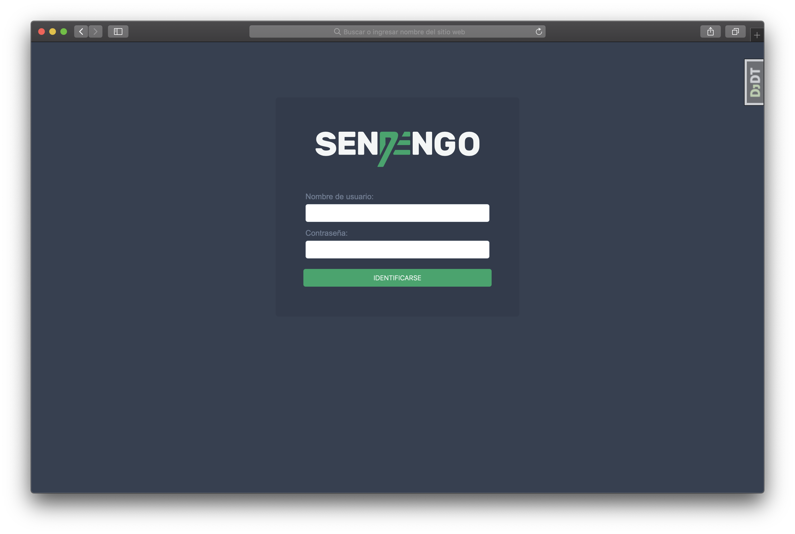
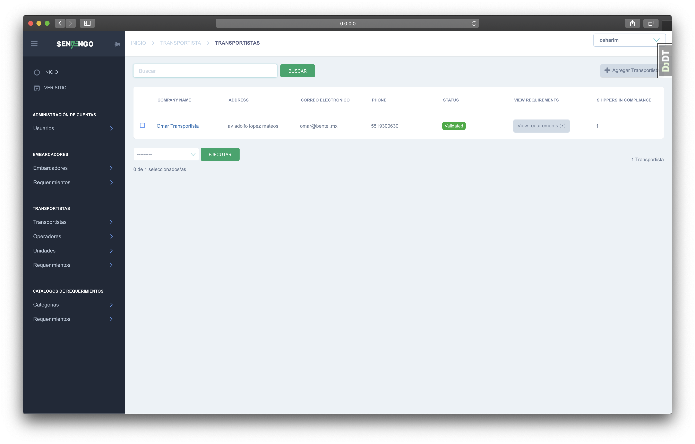
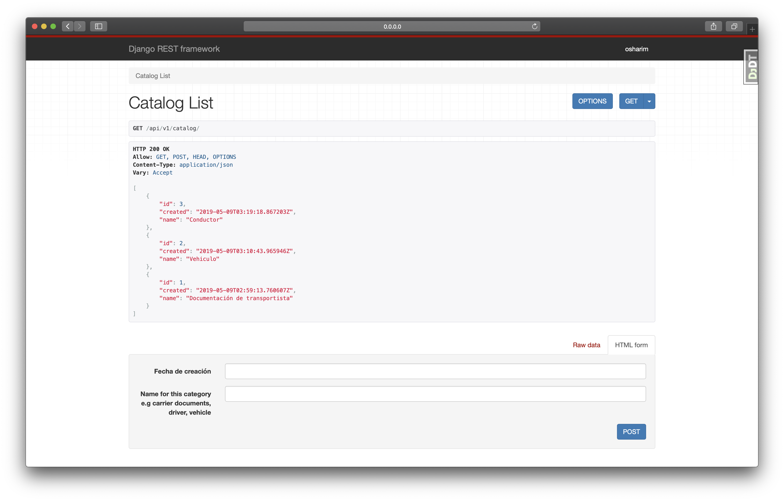

Sendengo
========
by @osharim 

Install
--------

Build docker Image

    $ docker-compose -f local.yml build

Run recent docker instance with the following command and wait.

    $ docker-compose -f local.yml up

Create a superuser attaching this command to our running instance 

    $ docker-compose -f local.yml run --rm django python manage.py createsuperuser

Now open the current port on your browser (must be http://0.0.0.0:8000/) and will appear a loggin session 

Settings
--------

Moved to config/settings 

Basic Commands
--------------

Test coverage
^^^^^^^^^^^^^

To run the tests, check your test coverage, and generate an HTML coverage report::

    $ coverage run -m pytest
    $ coverage html
    $ open htmlcov/index.html

Running tests with py.test
~~~~~~~~~~~~~~~~~~~~~~~~~~

::

  $ pytest
  

Deployment
----------

The following details how to deploy this application.

Heroku
^^^^^^

Need more time to explain how to upload this project to Heroku

Docker
^^^^^^

Need more time to explain how this docker recipe works 

API Doc
----------

Catalogos
^^^^^^

Todos los requerimientos de la plataforma se han consentrado en un listado de catalogos, este catalogo tiene como finalidad
el organizar todos los requerimientos a través de categorias.

Un Catalogo tiene categorias y todos los requerimientos estan relacionados a una categoria.

Obtener todos los catálogos
~~~~~~~~~~~~~~~~~~~~~~~~~~

::

  GET /api/v1/catalog/

  HTTP 200 OK
  Allow: GET, POST, HEAD, OPTIONS
  Content-Type: application/json
  Vary: Accept

  [
      {
          "id": 3,
          "created": "2019-05-09T03:19:18.867203Z",
          "name": "Conductor"
      },
      {
          "id": 2,
          "created": "2019-05-09T03:10:43.965946Z",
          "name": "Vehiculo"
      },
      {
          "id": 1,
          "created": "2019-05-09T02:59:13.760607Z",
          "name": "Documentación de transportista"
      }
  ]

Obtener la instancia de un solo catalogo 
~~~~~~~~~~~~~~~~~~~~~~~~~~

::

  GET /api/v1/catalog/1/

  HTTP 200 OK
  Allow: GET, PUT, PATCH, DELETE, HEAD, OPTIONS
  Content-Type: application/json
  Vary: Accept

  {
      "id": 1,
      "created": "2019-05-09T02:59:13.760607Z",
      "name": "Documentación de transportista"
  }

Obtener la todos los requerimientos organizados en un catalogo
~~~~~~~~~~~~~~~~~~~~~~~~~~

::

  GET /api/v1/catalog/1/requirements/

  HTTP 200 OK
  Allow: GET, POST, HEAD, OPTIONS
  Content-Type: application/json
  Vary: Accept

  [
      {
          "id": 10,
          "created": "2019-05-09T03:22:20.878837Z",
          "name": "Comprobante de domicilio del representante legal",
          "category": 1
      },
      {
          "id": 2,
          "created": "2019-05-09T03:02:53.885238Z",
          "name": "Acta constitutiva",
          "category": 1
      },
      {
          "id": 1,
          "created": "2019-05-09T03:02:45.816558Z",
          "name": "RFC",
          "category": 1
      }
  ]

Shipper(Embarcadero)
^^^^^^

Obtener todos los embarcaderos
~~~~~~~~~~~~~~~~~~~~~~~~~~

::

  GET /api/v1/shipper/
  HTTP 200 OK
  Allow: GET, POST, HEAD, OPTIONS
  Content-Type: application/json
  Vary: Accept

  [
      {
          "id": 1,
          "created": "2019-05-09T03:49:49.886842Z",
          "company_name": "Omar Shipper Company",
          "address": "av adolfo lopez mateos",
          "phone": "5519300630",
          "email": "omar.sh.bentel@gmail.com",
          "num_requirements": 4
      },
      {
          "id": 2,
          "created": "2019-05-09T03:50:41.487076Z",
          "company_name": "Amairani Shipper Company",
          "address": "Lago chiem 104 Reforma pencil",
          "phone": "5519300629",
          "email": "amairani@gmail.com",
          "num_requirements": 2
      }
  ]

